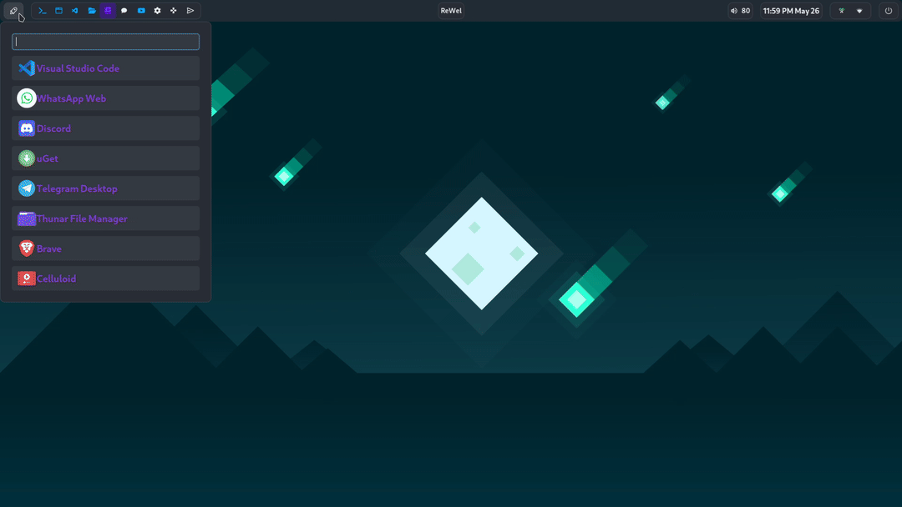

# Hypr-dots

> - Hyprland
>
> - AGS
>
> - MPD

Used here:

- [Aylur's GTK Shell](https://github.com/Aylur/ags).
- [Rofi (lbonn's wayland fork)](https://github.com/lbonn/rofi).
- [Warp-Terminal](https://www.warp.dev/), [Alacritty](https://alacritty.org/), [Kitty](https://sw.kovidgoyal.net/kitty/).
- [Hyprlock](https://github.com/hyprwm/hyprlock), [hyprpicker](https://github.com/hyprwm/hyprpicker)., [hypridle](https://github.com/hyprwm/hypridle)
- [Music Player Daemon](https://musicpd.org/) + [ncmpcpp](https://github.com/ncmpcpp/ncmpcpp) & [mpd-mpris](https://github.com/natsukagami/mpd-mpris).
- Wallpaper utility: [wbg](https://codeberg.org/dnkl/wbg).
- Clipboard manager: [CopyQ](https://github.com/hluk/CopyQ).
- Notification Daemon: [AGS](https://aylur.github.io/ags-docs/services/notifications/).
- [Zsh](https://www.zsh.org/), [ble.sh(Bash)](https://github.com/akinomyoga/ble.sh).
- GTK Theme: One-Dark.
  - [Gradience](https://github.com/GradienceTeam/Gradience) adw-gtk3
- Cursor: [Colloid](https://github.com/vinceliuice/Colloid-icon-theme).
- [GNU Stow](https://www.gnu.org/software/stow/)



[Hyprland + ArchLinux](https://github.com/ARKye03/dotfiles/tree/HyprArch)

## Usage

  Install stow, dependencies and clone the repo.
  
  ```sh
  git clone https://github.com/ARKye03/HyprDots.git
  cd HyprDots
  stow . --dotfiles
  ```

  Have in mind that if stow finds a file that already exists, it will not overwrite it.

### Theoretically, this should work. If not, may god have mercy on your soul
