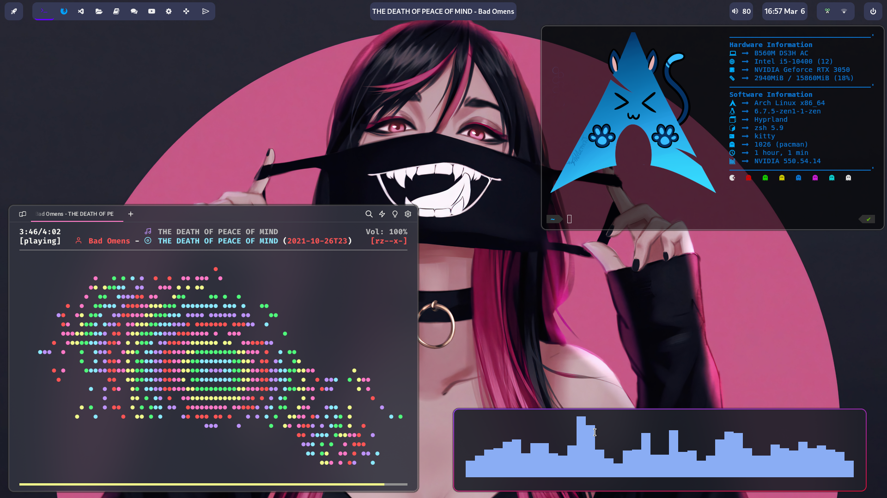

# Hypr-dots

> - Hyprland
>
> - AGS
>
> - MPD

Used here:

- Aylur's GTK Shell.
- Rofi (lbonn's wayland fork).
- Warp-Terminal, Alacritty, Kitty.
- Hyprlock, hyprpicker.
- Music Player Daemon + ncmpcpp & mpc.
- Wallpaper utility: wbg.
- Clipboard manager: Copyq.
- Notification Daemon: AGS.
- Zsh, ble.sh(Bash).
- GTK Theme: Catppuccin-Mocha-Standard-Mauve-Dark.
- Cursor: Colloid.

[Hyprland + ArchLinux](https://github.com/ARKye03/dotfiles/tree/HyprArch)
